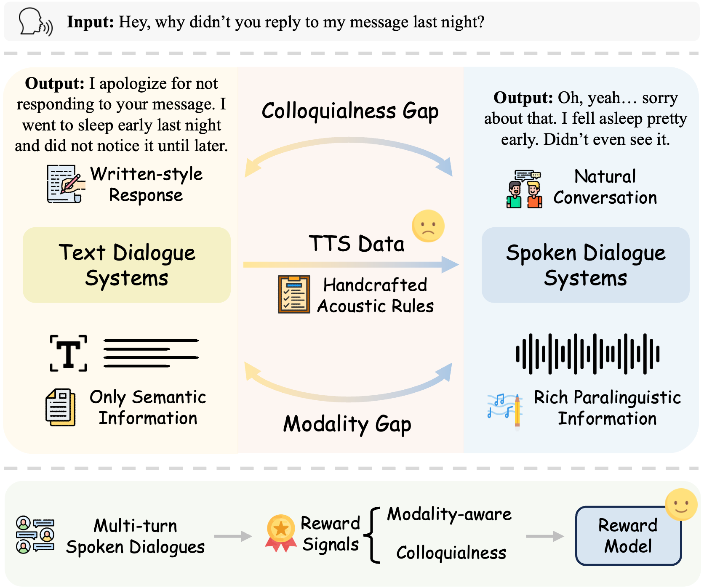

# SDiaReward: Modeling and Benchmarking Spoken Dialogue Rewards with Modality and Colloquialness

> Official repository for "Modeling and Benchmarking Spoken Dialogue Rewards with Modality and Colloquialness" (**Accepted to ACL 2026 Main Conference** 🎉).

<p align="center">
  <a href="https://arxiv.org/abs/2603.14889"></a>
  <a href="https://sdiareward.github.io/"></a>
  <a href="https://huggingface.co/your_huggingface_org"></a>
  <a href="https://huggingface.co/datasets/your_huggingface_org"></a>
</p>

## 🔔 News
- [x] **[2026.04.06]** 🎉 Our paper has been accepted to **ACL 2026 Main Conference**!
- [x] **[2026.03.17]** 💻 We have officially released the training and evaluation code!
- [x] **[2026.03.17]** 🔥 Our paper is now available on [](https://arxiv.org/abs/2603.14889)
- [ ] **[TODO]** Release SDiaReward-3B and 7B model weights on HuggingFace.
- [ ] **[TODO]** Release ESDR-Bench and SDiaReward-Dataset.

---

## Overview

<p align="center">
  
</p>

SDiaReward is an end-to-end multi-turn reward model for evaluating spoken dialogue quality. It operates directly on full multi-turn speech episodes and is optimized with pairwise preference supervision, enabling joint assessment of **modality-awareness** (prosody, emotion, acoustic naturalness) and **colloquialness** (conversational spontaneity vs. scripted style) in a single evaluator.

Built on [Qwen2.5-Omni](https://github.com/QwenLM/Qwen2.5-Omni), SDiaReward extends the multimodal LLM backbone with a pooling layer and linear score head for scalar reward prediction. It is trained on **SDiaReward-Dataset**, a collection of ~13k episode-level preference pairs (~200 hours of paired speech), and evaluated on **ESDR-Bench**, a stratified benchmark for robust episode-level evaluation.

## Key Results

SDiaReward achieves state-of-the-art pairwise preference accuracy on ESDR-Bench, significantly outperforming general-purpose audio LLMs:

| Model | Modality Micro | Modality Macro | Colloquialness | Overall Micro | Overall Macro |
|---|---|---|---|---|---|
| GPT-4o Audio | 51.12 | 50.47 | 98.00 | 57.91 | 74.23 |
| Gemini 2.5 Pro | 72.63 | 70.50 | 98.80 | 76.42 | 84.65 |
| Qwen 2.5 Omni 7B | 51.85 | 51.82 | 49.20 | 51.47 | 50.51 |
| Kimi-Audio | 65.30 | 63.38 | 66.00 | 65.40 | 64.69 |
| **SDiaReward 3B** | 88.62 | 79.20 | 92.00 | 89.11 | 85.60 |
| **SDiaReward 7B** | **96.61** | **94.91** | 97.20 | **96.70** | **96.06** |

## Architecture

SDiaReward processes interleaved speech-text multi-turn dialogues through a multimodal LLM backbone and computes scalar rewards via:

```math
r(\mathcal{C}, y) = \text{MLP}(\text{Pool}(H))
```

where `H` is the hidden representation from the final transformer layer, and `Pool(·)` is a sequence-level pooling operator. The model supports three pooling strategies:

- **Mean Pooling** (default, best stability and accuracy)
- **Attention Pooling** (learnable, higher variance)
- **Last-Token Pooling**

The model is trained with a Bradley-Terry pairwise preference loss with center loss regularization to prevent reward score drift.

## Installation

```bash
pip install -r requirements.txt
```

Core dependencies: `PyTorch >= 2.4.0`, `Transformers >= 4.46.0`, `DeepSpeed >= 0.14.0`, `TRL >= 0.21.0`, `qwen_omni_utils >= 0.0.8`.

## Quick Start

### Inference

Score a single conversation:

```bash
python inference.py \
    --ckpt_dir <path_to_reward_model_checkpoint> \
    --base_ckpt <path_to_base_qwen_omni_model> \
    --conversation_json <path_to_conversation.json>
```

The conversation JSON should contain a list of message dicts with interleaved text and audio:

```json
[
    {"role": "user", "content": [
        {"type": "text", "text": "Hello, how are you?"},
        {"type": "audio", "audio": "path/to/user_audio.wav"}
    ]},
    {"role": "assistant", "content": [
        {"type": "text", "text": "I'm doing great!"},
        {"type": "audio", "audio": "path/to/assistant_audio.wav"}
    ]}
]
```

### Training

**3B model:**
```bash
bash scripts/train_3b.sh
```

**7B model:**
```bash
bash scripts/train_7b.sh
```

Before running, edit the script to set:
- `MODEL_NAME_OR_PATH`: path to base Qwen2.5-Omni checkpoint
- `DATASET_NAME`: path to the preference dataset
- `CUDA_VISIBLE_DEVICES` / `NUM_GPUS`: adjust for your hardware

### Evaluation

```bash
python eval_model.py \
    --ckpt_dir <path_to_checkpoint> \
    --base_ckpt <path_to_base_qwen_omni_model> \
    --dataset_path <path_to_eval_dataset> \
    --output_dir eval_outputs/
```

## Project Structure

```text
SDiaReward/
├── model/
│   ├── modeling_qwen_omni_thinker_reward.py   # Reward model (pooling + score head)
│   └── processing_qwen_omni_thinker_reward.py # Multimodal processor
├── trainer/
│   ├── multimodal_reward_trainer.py           # Custom reward trainer
│   └── collator.py                            # Data collator & dataset wrapper
├── utils/
│   ├── fast_whisper_feature_extractor.py      # Optimized audio feature extractor
│   └── load_utils.py                          # Dataset loading utilities
├── deepspeed_configs/                         # ZeRO-2/3/3-offload configs
├── scripts/
│   ├── train_3b.sh                            # 3B training launch script
│   └── train_7b.sh                            # 7B training launch script
├── train.py                                   # Training entry point
├── eval_model.py                              # Evaluation script
├── inference.py                               # Inference example
└── requirements.txt
```

## Dataset Format

The training data should be a HuggingFace Dataset (or JSON) with `chosen` and `rejected` fields, each containing a multi-turn conversation in the chat format. Each turn can include text, audio, image, or video content.

## Citation

If you find this project useful for your research, please consider citing our paper:

```bibtex
@misc{lu2026modelingbenchmarkingspokendialogue,
      title={Modeling and Benchmarking Spoken Dialogue Rewards with Modality and Colloquialness}, 
      author={Jingyu Lu and Yuhan Wang and Fan Zhuo and Xize Cheng and Changhao Pan and Xueyi Pu and Yifu Chen and Chenyuhao Wen and Tianle Liang and Zhou Zhao},
      year={2026},
      eprint={2603.14889},
      archivePrefix={arXiv},
      primaryClass={eess.AS},
      url={https://arxiv.org/abs/2603.14889}, 
}
```

## Disclaimer & License

This project is intended for research purposes only. The code is licensed under the Apache 2.0 License. 

Due to copyright and privacy considerations, the public repository only contains derived artifacts for the **SDiaReward-Dataset** and **ESDR-Bench**. To request access to the original audio data, please contact us via email at lujingyu@zju.edu.cn.
